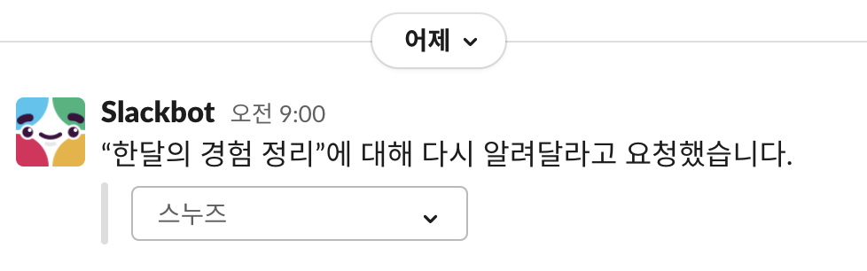
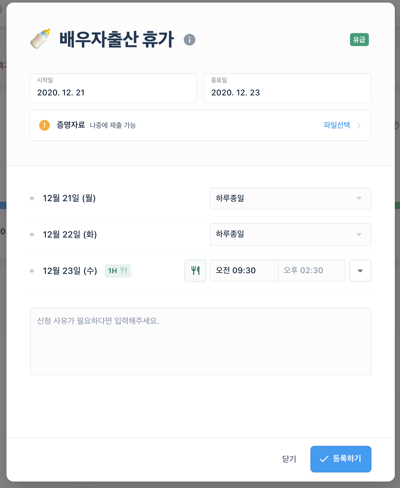
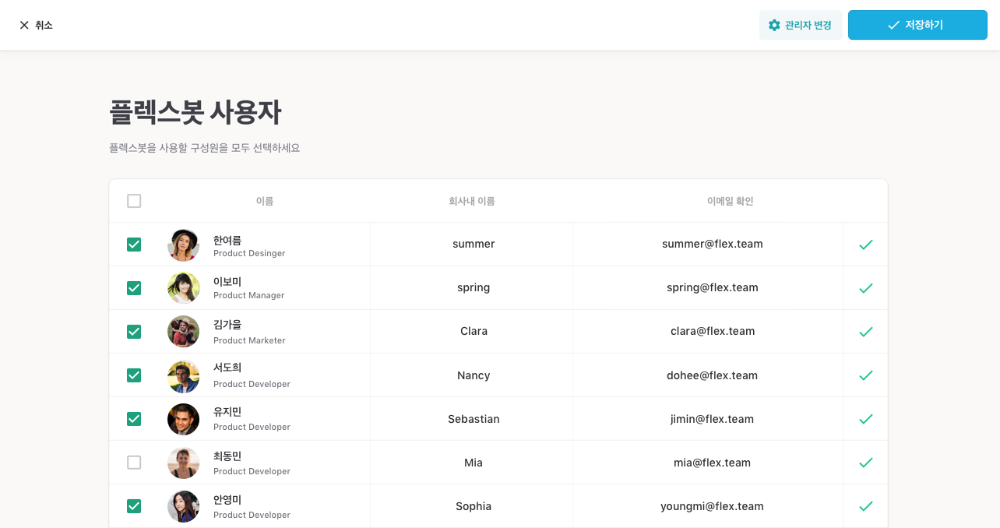
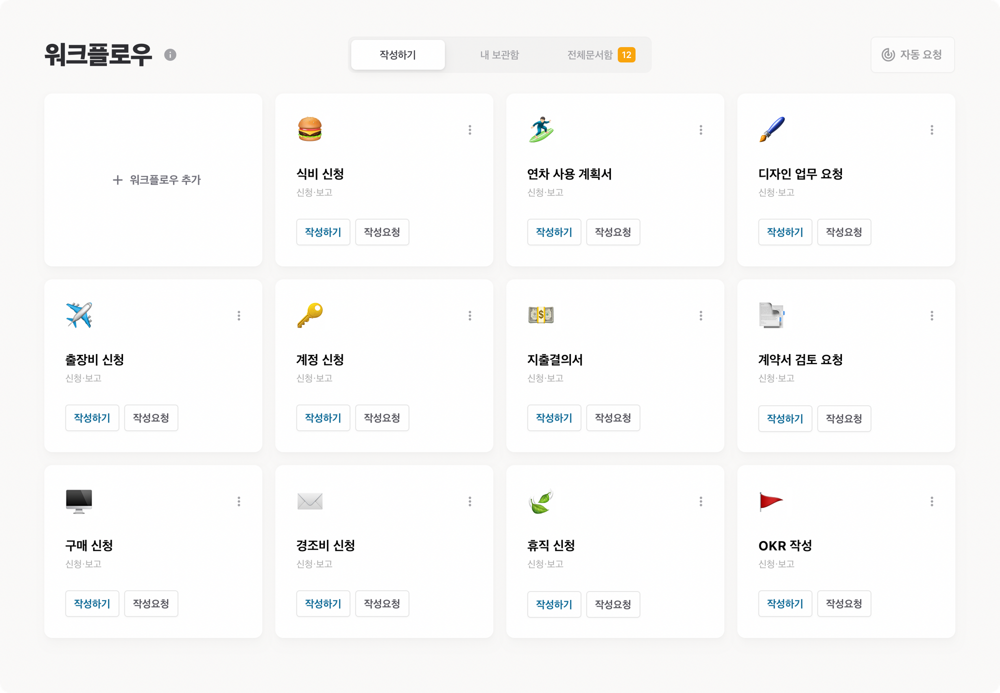
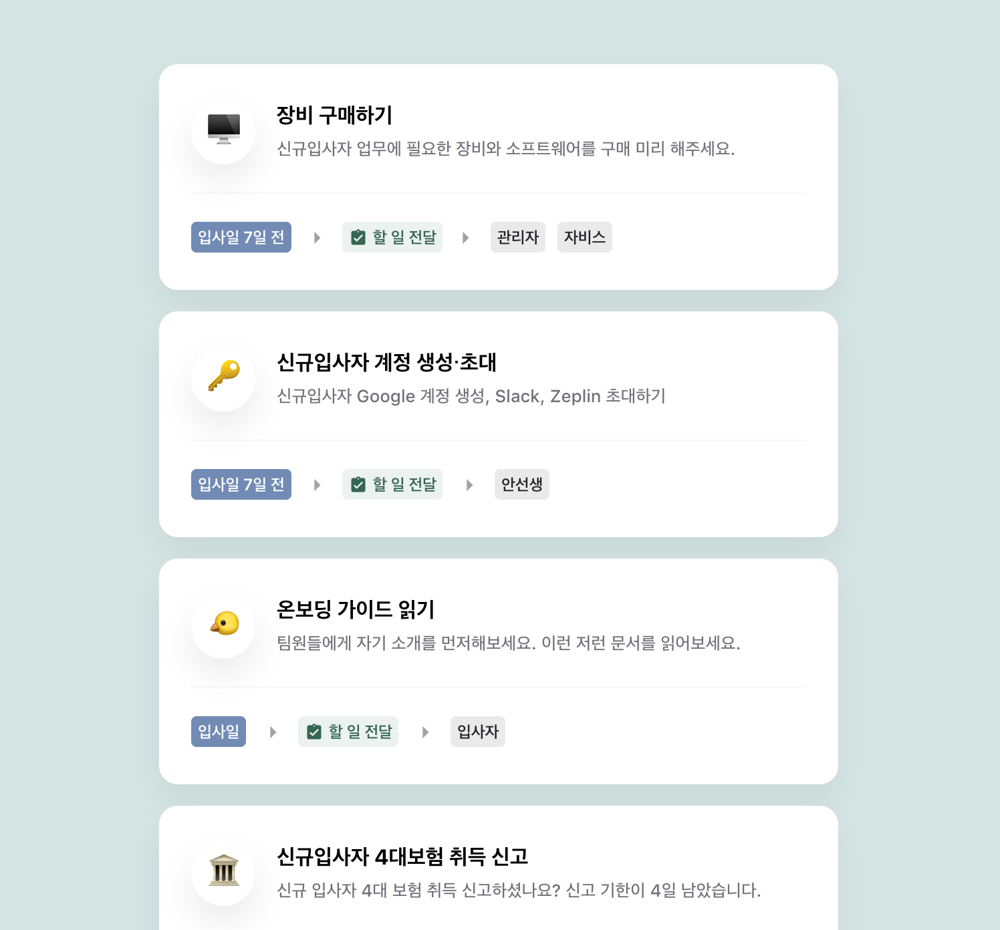
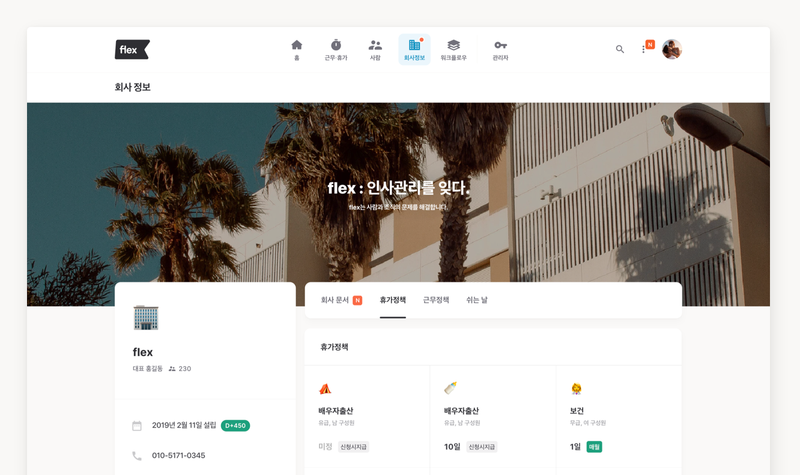
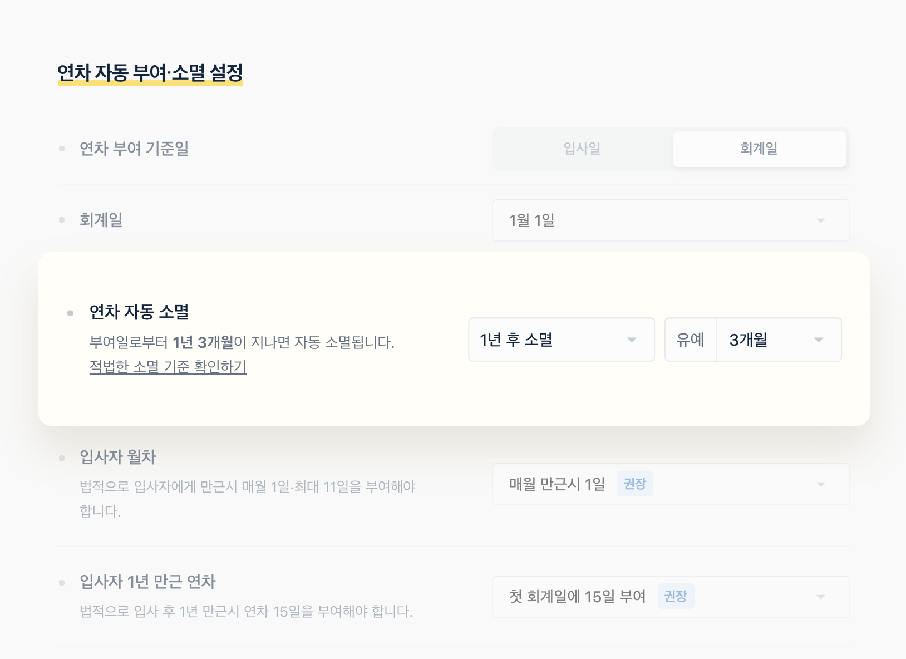
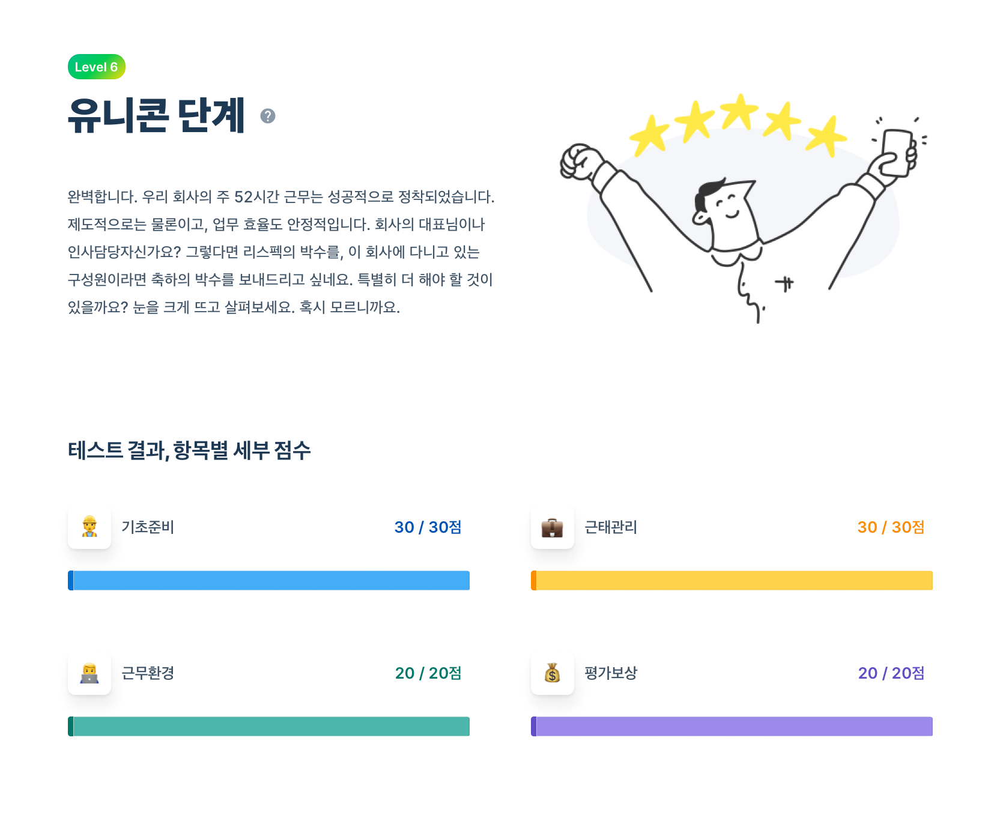
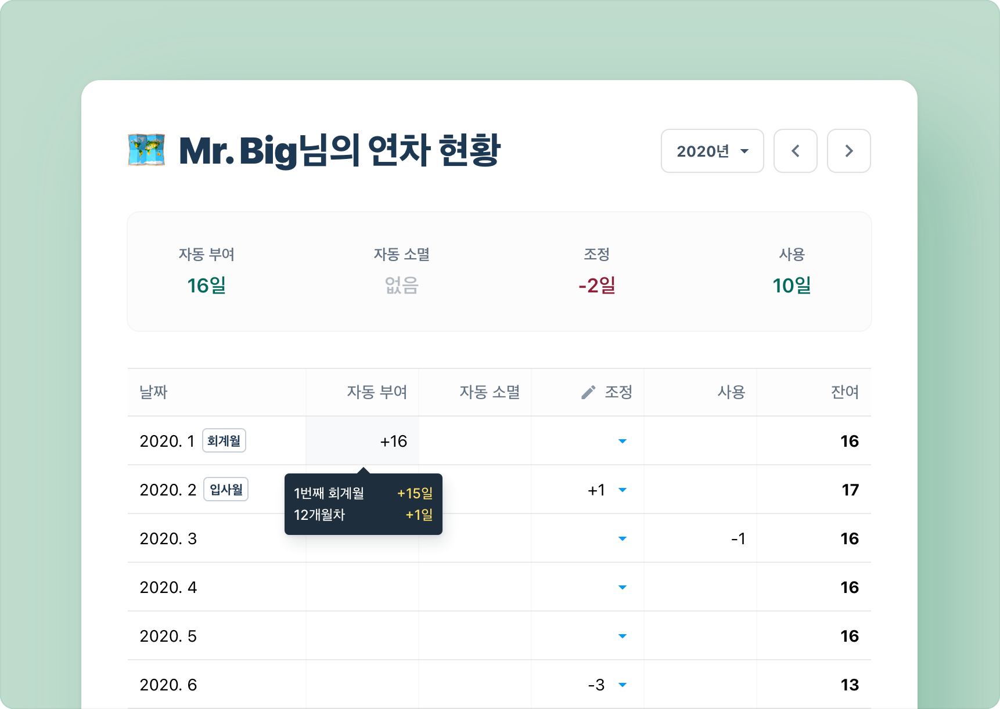
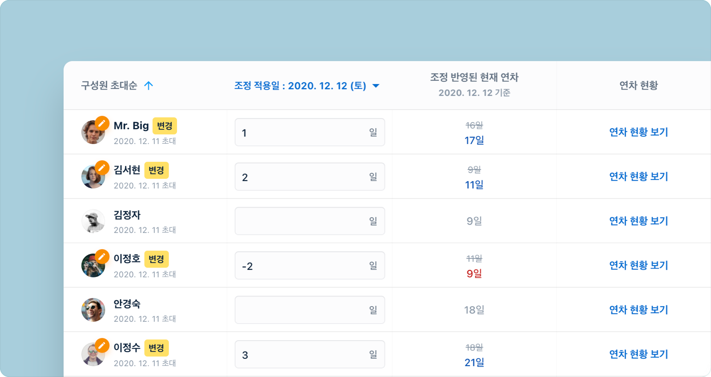

# 들어가며

[플렉스팀](http://flex.team/)에 합류한지도 벌써 1년이 되었다. 시간이 정말 빠르다! 입사하면서 한 달에 한 번씩은 뭘 했는지 정리하려고 야심차게 슬랙 리마인더를 걸어놨지만... 바쁘다는 핑계로 한 번도 제대로 작성한 적이 없다.

이대로 그냥 지나가면 다 까먹을 것 같아서 좀 늦었지만 1년 동안 무엇을 했는지 간단히 돌아본다.

나는 회사에서 주로 프론트엔드 작업을 담당한다. 특별한 언급이 없는 이상 ‘A라는 기능을 구현했다’는 말은 ‘A라는 기능 구현의 프론트엔드를 담당했다’라는 의미이다.

# 2019년

# 1월

작년 12월 말부터 올해 1월까지는 우리 제품이 다루는 도메인을 이해하고 익숙해지는 시간이었다.

진행한 작업은 근무 일정 화면의 요약 정보 UI, 하루의 스케쥴을 보여주고 편집하는 UI 등의 수정 등이다. 위 스크린샷의 시간 선택기도 만들었는데, UX를 위해 꽤 복잡한 로직이 들어간다. 처음으로 로직을 다 별도로 빼고 단위 테스트를 꼼꼼히 작성하면서 만들어 봤는데, 테스트의 유용함을 체감했다. 레퍼런스로 삼은 구글 캘린더의 시간 입력기가 참 잘 만들었다는 걸 느꼈다 😄

이 과정에서 근태 관련 개념들, 근로기준법, 노동법 등의 도메인 지식을 많이 배웠다. 배울 개념도 많고 복잡해서 처음엔 당황하고 일정 산정도 실패하곤 했다. 하지만 좀 익숙해진 후부터는 복잡한 도메인을 다루는 재미를 느끼기 시작했다. 게임이 익숙해져 루즈하다고 느낄 때 쯤 어려운 난이도의 다음 레벨을 접한 기분이었다.

오픈 베타를 앞두고 있던 때라, 웨이팅 리스트를 등록하는 기능도 구현했다. 좀 쓰고 말 줄 알고 간단하게 AWS Lambda를 사용해 구글 폼으로 데이터를 쏴서 스프레드시트에 쌓는 형태로 구현했는데, 아직까지 쓰고 있어서… 참 사람 일과 코드 일(?)은 어떻게 될지 모르는 것 같다.

그 외에는 기존에 세팅된 Sentry에 트러블슈팅에 필요한 추가적인 정보를 남기고, 개발이 중단된 tslint를 eslint로 대체하고 lint-staged 및 husky를 설치해 좀 더 빠른 시점에 린트 오류를 잡을 수 있게 만드는 등, 개발 및 디버깅 과정을 개선하는 작업도 몇 가지 진행했다.

# 2월

계속해서 근태 관련된 기존 코드를 수정 및 개선하는 작업을 진행했다. 근무만 신청 가능하던 UI 상에서 휴가를 신청 가능케 하고, 등록 전에 미리 등록 후 어떤 상태가 될지를 보여주는 기능을 구현했으며, 근무 승인 설정 페이지의 새 디자인을 적용했다.

React Profiler를 사용해 Redux와 관련된 제품 전반적인 렌더링 로직의 비효율을 파악하고 해결 및 공유한 일도 있었는데, 프로파일러를 처음 제대로 적용해 봐 재밌기도 하고 낮게 열린 열매를 딴 것 뿐인데 적지 않은 개선이 있어 기분이 좋았다.

그 외엔 기존에 API 오류만 기록하던 Sentry에 ErrorBoundary를 추가하고, Release API를 사용해 빌드 타임에 소스맵을 업로드하는 과정을 추가했다. 또 기존에 프롬프트로 받던 환경 변수를 dotenv로 이관하는 등, DX 관련 짜잘한 작업도 이어갔다.

# 3월

“맞춤 근무” 기능을 구현했다. 그 전까지는 근무의 유형이 “근무”, “외근”, “원격” 등 미리 정의된 몇 값 뿐이다보니 출장이나 회사에만 있는 특수한 시간을 따로 등록하고 싶다는 요구사항이 종종 들어왔다. “맞춤 근무”는 위 스크린샷처럼 임의의 근무 정책을 만들어 쓸 수 있도록 하는 기능이다.

우리 팀은 – 버그가 아닌 개선이나 신기능 요청에 있어서는 – 다양한 고객의 목소리로부터 요구사항을 수집하되, **매번 눈 앞에 놓인 문제를 각개격파하기보단 가급적 다양한 유즈 케이스를 해결하는 일반적인 접근을 찾으려 노력한다**. 이 경우에 “출장” 유형을 추가하고 넘어가는 대신 맞춤 근무 기능을 구현한 것도 같은 맥락이다.

수많은 회사 별로 근무, 연차, 휴가, 결재, 조직 등을 관리하는 정책이 **그야말로 천차만별임을** 반복되는 경험을 통해 배웠기 때문이다. 몇 회사의 케이스만 염두에 둔 해결책이 바로 다음 회사에서 막다른 골목을 맞이하는 일을 여러번 겪으며 얻은 일종의 생존 전략(?)이라 할 수 있겠다.

지금 사용 중인, 또는 도입을 고려중인 고객의 요구사항만을 구현하기는 쉽지만, 그런 방식으론 확장 가능한 제품이 나오기 어렵다. 다른 한편으로는, 큰 고민 없이 임의의 요구사항을 모두 받아주는 (받아주기만 하는) 너무 일반적인 툴을 만들다 보면 ‘모든 니즈를 충족시킬 수는 있지만 어떤 경우에도 쓰기 편하지 않은 툴’이 나오기 십상이다.

충분히 일반적이면서도 대부분의 경우에 쓰기 편한 툴을 만드려면 많은 노력과 고민이 필요한데, 지금 회사에서 좋은 동료들 덕에 그 재미를 많이 느끼며 좋은 제품을 만들고 있다. 어렵지만 하다보면 재미도 있다 :)

팀원과 고객이 많아지고 제품의 개선 주기도 빨라지면서, 3월부터는 릴리즈 주기에 맞추어 업데이트 노트를 발송하기 시작했다. (작업한 내용이 끝나자마자 바로 나가는 것은 아니라, 작업 일정과 업데이트 노트 발송일 사이엔 간극이 존재한다)

## 3월의 업데이트 노트

* [20-03-28 우리 회사만의 맞춤근무 설정](https://www.notion.so/20-03-28-8af0ab33f05e4ab4a266c5c81321b753)

# 4월

이 달에 작업한 내용 중 아직까지 제품에 남아있는 건 이 모달 뿐이다. 연차를 포함한 회사별 정책에 따른 다양한 휴가를 사용하는 모달의 UI를 전반적으로 싹 개편했다. 이 작업을 하면서 휴가에 어떤 종류가 있는지, 휴가 정책, 부여와 사용 내역이 각각 어떤 데이터를 갖는지 등에 처음으로 익숙해졌다.

또 이 때 Makers’ Choice 라는, 메이커들이 각자 만들고픈 것을 만드는 스프린트를 한 번 진행했다. 당시 꽂힌 주제가 있어서 최소한의 스펙으로 작업까진 했는데 아쉽게도 다른 사정으로 출시 못 한 상태이다. 그 때 풀려고 했던 문제와 비슷한 요구사항은 꾸준히 나오고 있는데, 아마도 내년 쯤에는 다른 스쿼드에서 같은 문제를 훨씬 멋지게 풀어주실 듯 하여 기대하는 마음으로 지켜보고 있다 😁

그 외에 슬랙 연동 기능을 준비하며 flex 구성원을 슬랙 워크스페이스 유저와 매칭하는 화면을 만들었다. 초반에 잠깐 쓰이다가 지금은 개선된 화면으로 대체되었다.

## 4월의 업데이트 노트

* [20-04-16 flex에 등록한 일정을 구글캘린더에서?](https://www.notion.so/20-04-16-flex-a38331bb99094368aa11f273f5a29482)

# 5월

휴일에 근무한 구성원이 있는 경우 다른 소정근로일을 휴일로 대체하는 대체 휴무 기능을 구현했다. 처음 생각한 구현 방향은 스펙도 매우 복잡하고 쓰기도 불편한 형태였다. 스쿼드 내에서 열심히 머리를 모아 구현 비용도 줄이고 사용자에게도 훨씬 나은 경험을 제공하는 지금의 형태를 찾아냈을 때 기분이 참 좋았던 기억이 난다.

그 외에는 내부적으로 사용하는 디자인 시스템 구현체인 FDS(Flex Design System) 관련 자잘한 픽스 및 리팩토링을 진행했다. 고객 유입을 위해 랜딩 페이지 내 “무엇이든 물어보세요” 페이지를 구현하고, 다음 달에 출시하게 될 “360도 요청” 기능의 구현을 시작했다.

## 5월의 업데이트 노트

* [20-05-12 슬랙과 flex의 만남](https://www.notion.so/20-05-12-flex-53adf3d983314f8f9fe1a4129cad5fa5)

# 6월

“360도 요청”라는 이름으로 시작된, 기성 전자결재를 대체하는 제품을 구현했다. 관련 요청이 많기도 했고, 구성원의 라이프사이클, 근태/휴가 관련 이벤트 등에 다 접근이 가능한 우리 제품 내에서 기존 전자결재가 제공하지 못한 가치를 제공할 포인트가 많다는 공감대가 생겨 시작한 기능이었다. 이 기능은 최종적으로 “워크플로우”라는 이름으로 출시되었다.

또한 본격적인 랜딩 페이지 개편에 앞서, 전체 앱에 붙어서 함께 배포되던 랜딩 페이지를 따로 부담없이 배포할 수 있도록 별도 프로젝트로 분리했다. 이 과정에서 사이트 접근시 로그인 여부를 확인 후 랜딩 또는 앱으로 보내는 처리를 위해 Lambda@Edge를 처음으로 써 봤다.

DNS 캐시 때문에 블루/그린 배포시 예전 클라이언트에서 에셋에 제대로 접근하지 못하는 이슈도 에셋을 위한 버저닝된 별도 CDN을 마련하는 식으로 해결했다. 이런 처리를 하면서 그 전까지 제대로 모른 채로 쓰기만 했던 CloudFront의 설정과 기능에 자연스레 익숙해졌다.

## 6월의 업데이트 노트

* [20-06-09 편리하고 법에 맞는, 대체휴무 지급](https://www.notion.so/20-06-09-cfbeccc7e0734ecbaa080f851b4559e2)

# 7월

새 랜딩 페이지를 만들었다. 급여정산과 전자계약이라는 두 가지 큰 제품의 출시를 앞두고 그 전까지의 한 페이지짜리 랜딩 페이지가 완전히 개편되면서 많은 내용이 추가되었다. 배포 타겟이던 얼라인먼트 데이에 시간 맞춰 배포하고 회식 갈 수 있어 마음이 편했던 기억이 난다.

몇 페이지 안 되는 정적 사이트라 Next.js 대신 Gatsby를 사용해 구현했다. 큰 불만은 없지만 Next.js 쪽도 계속해서 SSG 유즈케이스를 더 잘 지원하는 방향으로 빠르게 발전 중이라 이제와 돌아보면 다른 기술을 사용한 것이 최선이었는지 살짝 아리송하다. 그와 별개로 블로그에서 쓰고 있던 Gatsby의 동작 원리를 이 때 제대로 이해할 수 있던 것은 좋았다.

제품 내에서는 워크플로우에 댓글 기능을 추가했다. 또 우리가 워크플로우를 처음 구상했을 때 킬러 피쳐가 될 수 있다고 생각했던 입사일, 특정 이벤트 등록 등의 트리거가 발생했을 때 자동으로 워크플로우를 등록하는 ‘자동 워크플로우’ 기능의 구현을 시작했다.

[고양이 두 마리와 함께 살기 시작했다.](https://www.instagram.com/bomnamools/)

## 7월의 업데이트 노트

* [20-07-03 전자결재보다 유연한 전자결재, ‘워크플로우’](https://www.notion.so/20-07-03-8217d64b26214cb0a8b5dcbe1fa8235e)
* [20-07-16 더 안전하고, 더 확실한 전자계약](https://www.notion.so/20-07-16-1074eee02968402ea5209758f7068a1f)
* [20-07-17 복잡한 급여정산, 복잡하지 않게](https://www.notion.so/20-07-17-7bdc3709828946dfb8009d9780d3c76b)
* [20-07-17 인사/계약정보 변경내역](https://www.notion.so/20-07-17-d2aab82e40eb4009a0f4a58dcb72618c)

# 8월

7월에 구현을 시작한 ‘자동 워크플로우’ 기능을 마무리하고 릴리즈했다. 일정 관계상 처음에 생각했던 모습에서 많은 부분이 빠진 스펙으로 나가게 되었다. 그 때문에 릴리즈가 기쁘면서도 아쉬웠다. 지금은 워크플로우만 전담하는 팀이 생겨 당시 원했지만 미처 구현 못 한 기능과 그 이상을 구현해주고 계셔서 참 좋고, 앞으로가 기대된다.

8월에는 팀의 업무/인력 구조 상 백엔드 쪽에 업무량이 많이 몰려 상대적으로 프론트엔드 개발자가 여유로웠다. 때문에 스쿼드 업무 외의 작업에 좀 시간을 썼다. 먼저 회사 블로그 사이트를 개발 및 런칭했다. 7월에 구현한 새 랜딩페이지와 비슷하게 Gatsby를 사용했다.

마케터 동료가 Wordpress에서 글을 작성하면 WPGraphQL이라는 플러그인을 사용해 Gatsby에서 데이터를 빌드 타임에 가져오는 식으로 구현했다. Next.js 쪽에도 [비슷한 워크플로우를 커버하는 예시](https://github.com/shuding/next-cms)가 있었지만 검토 당시 [Gatsby 쪽 플러그인](https://github.com/gatsbyjs/gatsby-source-wordpress-experimental)의 성숙도나 사용성이 더 높아보여 내린 결정이었는데, 이건 잘 한 선택이었다고 생각한다. 모든 데이터 소스를 GraphQL로 추상화해서 가져오는 방식의 (그리고 Wordpress 생태계의) 강력함을 느꼈다.

그 외에는 제품 내 시간이 오래 걸리는 작업이 점차 늘어남에 따라, 웹 소켓 사용 프로토타이핑을 진행했다. serverless 프레임워크를 사용해 API Gateway에 배포하는 형태로 구현했다. 또한 PM 동료의 요청으로 ElasticSearch + Google SpreadSheet API + CloudWatch의 조합으로 아주 간단한 데일리 로그 집계를 구현했다. ES의 동작에 대해 배울 수 있어 재밌었지만… 완성도가 높지 않아 조만간 데이터 엔지니어 동료가 합류해서 싹 바꿔주시길 기대하고 있다.

## 8월의 업데이트 노트

* [20-08-18 활용도 MAX! 자동 워크플로우와 급여정산](https://www.notion.so/20-08-18-MAX-0763807417424d658298f888f91db20a)

# 9월

회사정보 탭의 리디자인을 진행했다. 기존에 존재하던 정보를 재배치하고, 회사 로고, 배경화면 및 미션을 설정 가능하게 했다. 기능적으로는 바뀐 게 거의 없고 구현도 어렵지 않았지만 해놓고 보니 한결 풍성해진 회사정보 탭이 마음에 들었다. 좋아해주신 고객 분들도 많았던, 머리를 잠시 식히는 재밌는 작업이었다.

또한 그 때까지 쌓인 다양한 요구사항을 모두 충족할수 있도록 연차 설정, 부여, 사용에 관한 내용을 한 번 싹 다듬고 정리하는 연차 리팩토링 작업을 진행했다.

## 9월의 업데이트 노트

* [20-09-01 작은 변화가 주는 기쁨](https://www.notion.so/20-09-01-b11e810f20b14bf2a91e3951733a3add)
* [20-09-08 알아두면 편리한, 회사정보 탭 활용 꿀팁🍯](https://www.notion.so/20-09-08-0073359eee9e41dab8f20c0ff9644d41)

# 10월

“데모” 기능을 구현했다. flex는 HR과 관련된 도메인 전반을 다루는 제품이다. 그렇다 보니 관리자의 입장에서 입력해야 할 회사 차원의 정보가 굉장히 많다. 회사의 기본 정보부터, 어떤 근무 유형이 존재하는지, 어떤 휴가 정책이 있는지, 승인 관련 정책은 어떤지 등등… 기존엔 이러한 수많은 설정 중 우리가 필수라 정의한 꽤 많은 정보를 최초 회사 온보딩 시 요구했는데, 이 과정이 액티베이션 중 꽤나 큰 허들로 작용했다.

우리는 회사 온보딩 과정을 아예 없앰으로써 이 문제를 해결했다. 최초 가입시 초기 설정을 생략하고 여러 유즈 케이스를 확인할 수 있는 더미 데이터가 쌓인 데모 계정으로 바로 유저를 랜딩시켰다. 실수에 대한 부담 없이 이런 저런 기능을 시험해보다 둘러보기를 끝내고 실사용을 시작할 준비가 되면, 그 때 기본 값으로 계정을 초기화한 후에 실사용을 시작할 수 있게 했다.

제품 내 기능은 아니지만 주 52시간 계도기간의 종료가 다가옴에 따라 회사별로 당사의 정책이 얼마나 잘 되어있는지 확인하는 ‘주 52시간 진단’ 페이지도 구현했다. 이 기능으로 지하철 광고도 돌렸는데, 구현한 기능 소개 화면이 지하철 벽에 붙어있는 걸 보니 재미있었다 😁

마지막으로, 2021년 초를 배포 타겟으로 잡은 모바일 버전 구현을 시작했다. 10월에는 실제 기능 구현보다는 기술 리서치 및 학습을 진행하고, 초기 개발 환경 및 디자인 시스템 컴포넌트 등을 세팅하는 데 시간을 썼다. 여러 요소를 고려해 React Native를 선택했는데, React에 대한 익숙함과 Flutter로 개인 앱을 한 번 만들어 본 경험이 많은 도움이 되었다.

## 10월의 업데이트 노트

* [20-10-15 급여업무와 자율주행의 공통점?🏎️](https://www.notion.so/20-10-15-701aeb1898394c0a8200e20901a12526)

# 11월

고급 승인 설정 개편을 진행했다. 승인 또는 알림을 처리하려다보면 “조직장 승인” 설정인데 요청자 본인이 조직장이거나 해당 조직에 조직장이 부재중인 등의 예외 상황이 발생한다. 기존엔 이런 예외시 처리 로직이 우리가 임의로 정한 규칙대로였고 제품 내에서 확인할 수단도 없었다. 그래서 관련 문의도 자주 들어오고 많은 고객 분들이 (심지어 우리도) 혼란을 격었는데, 이러한 예외 처리 단계를 다 드러내고 설정 가능하게 변경했다.

또한 근무/휴가 피드의 이관을 진행했다. “할 일” 이라는 개념이 제품 내에 생기기 전, 근무 승인 관련, 또 휴가 승인 관련 피는 각 맥락별로 전혀 다른 형태로 구현되어 있었다. 잘 동작했지만, 할 일 피드가 사용자의 액션이 필요한 다양한 상황을 담는 그릇이 되면서 예전에 구현된 근무 및 휴가도 통일성을 위해 할 일 피드로 들여왔다. 본격적인 모바일 구현 전에 진행한 덕에 모바일에서도 구현할 양이 다소 줄어들었다.

팀의 [시리즈A 100억원 투자 유치 소식](https://flex.team/blog/2020/11/11/flex-series-a-investment/)이 공개되었다.

## 11월의 업데이트 노트

* [20-11-03 인사관리, 감에 의존하셨나요? ‘인사이트’](https://www.notion.so/20-11-03-5b02616170404ae09b7f315818bf2680)
* [20-11-20 인사발령을 앞두고 계신가요?](https://www.notion.so/flexnotion/20-11-20-d70811c8e3d946e58b09e6b13370be43)

# 12월

9월에 진행한 연차 리팩토링 작업에서 부족한 부분이 여럿 발견되어서 한 번 더 싹 뒤집어 엎는 작업을 진행했다. 개인의 부여, 소멸, 조정, 사용 등의 일정을 모두 한 눈에 확인할 수 있게 하고 사용 내역 기록, 조정 등도 더 편리하게 변경했다.

연차는 정책별로 달라지는 부분이 꽤나 많고 복잡한데 비해 잘 동작한다고 감탄을 주기는 어렵고, 한편 버그가 있으면 민감도가 높을 수 밖에 없는 기능이라… 여러모로 애증의 관계다. 이 스프린트에 모든 문제를 해결하는 것이 목표였으나 진행하다보니 일정 상 그 상태까지는 못 가고 한 번 끊고 가게 되었다. 졌지만 잘 싸웠다. 다음엔 이긴다!

연차 리팩토링을 끝낸 이후로 지금까지는 모바일 앱 구현에 집중하고 있다. 10월에 깔아놓은 바닥 위에서 실제 기능을 열심히 구현하면서 프로덕션 출시 및 운영을 준비 중이다. 처음 써보는 기술로 처음으로 회사에서 앱 개발을 해보는 거라 걱정했는데, 속도나 결과물 퀄리티가 나쁘지 않게 나오고 있어 자신감이 붙고 있다.

## 12월의 업데이트 노트

* [20-12-14 워크플로우, 포괄임금 근무유형, 구성원 스케줄 등](https://www.notion.so/flexnotion/20-12-14-eac0cc9256d84ca5b3fc21caef6efff5)

# 맺으며

**뭘 정말 많이 했구나**! 처음 정리 글을 써야겠다고 생각했을 때 예상한 것보다 너무 오래 걸렸다. 정신 없고, 새로운 경험을 참 많이 한 일 년 이었다.

웹 프론트엔드 개발자의 관점으로는, 지금까지의 겪은 제품들보다 아득히 복잡도가 높고 규모도 큰 어플리케이션에 익숙해지는 시간이었다. 새로운 복잡도와 규모는 새로운 문제를 – 특히 팀의 생산성 관련해 – 가져온다는 걸 배웠다. 해결하고자 시도하는 과정에서 많이 배웠지만, 결과적으로 빌드 속도 개선, 디자인 시스템 사용 방식 개선 등 계획을 실제 성과까지 못 이어낸 영역이 많아 아쉽다. 삽질도 어느정도 하고 팀원도 더 많아졌으니 내년엔 수확을 하는 한 해가 되길 기대한다.

웹 프론트엔드 바깥에서는, 인프라, 데이터 쪽도 조금씩 맛보고(?) 지금은 모바일 앱을 만들고 있 것처럼, 익숙한 영역을 벗어난 업무를 접할 기회가 많았다. 억지로 떠맡겨진 일은 하나도 없고 상황이 적절할 때 자원해서 시작된 일들이었다. 부족한 면이 많은데 믿고 맡겨주면서도 필요한 도움은 아낌없이 제공해준 팀원들 덕에 가능했던 것 같다. 앞으로도 기회가 있을 때마다 이런 도전을 하면서 영역을 넓혀갈 수 있으면 더 할 나위 없이 좋겠다.

개발 외에도 합이 맞는 동료들과 고객의 불편함을 듣고 해결책의 초기 기획 단계부터 더 밀접하게 함께 논의하고 제품을 만들고 부셔나가는 과정 자체가 참 즐거웠다. 프론트엔드 개발자가 늘어나면서 챕터로서 성장하는 과정에서도 배운 게 많았고… 작은 회사에 들어오면서 실제로 제품과 팀을 초반부터 함께 만들어나가는 경험을 기대했는데, **2020년은 그 기대가 초과달성 되는 한 해였다.**

이 글에는 내가 참여한 일부만 정리되어 있지만, 1년 동안 제품에는 당연히 이 글에 담긴 것보다 훨씬, 훨씬 더 많은 변경사항이 있었다. (원래 다른 분들이 작업한 제품의 모든 변경사항을 다 담을 생각이었는데 글이 너무 길어져서 포기했다…) 팀 규모도 내가 합류할 당시 14명에서 지금은 40명을 바라볼 정도로 커졌다.

앞으로 또 1년이 지난 후에는 또 우리 팀과 제품이 어떤 모습이 되어있을지 궁금하고 기대된다. 내년에도 열심히 해야지~!

# 채용 공고

이런 글에 빠지면 아쉬운 채용 링크로 글을 마쳐 봅니다. 모든 회사가 ‘인사관리를 잊고’ 각 회사의 미션에 집중할 수 있도록 돕는 제품을 만들고 있습니다. 훌륭한 동료들이 모여 같은 목표로 열심히 하고 있는데요. 팀과 제품이 빠르게 진화하면서 감사하게도 투자도 받고 고객 분들도 늘고 있지만, 저희가 그리는 비전을 생각하면 아직 갈 길이 먼 걸음마 단계라 생각합니다. **이제 막 시작한 플렉스팀의 여정에 함께하고픈 분들께선 꼭 [채용 공고](https://bit.ly/flexteam_recruit)를 확인하시길!**
